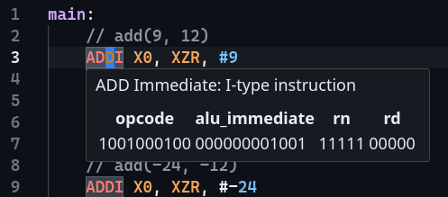
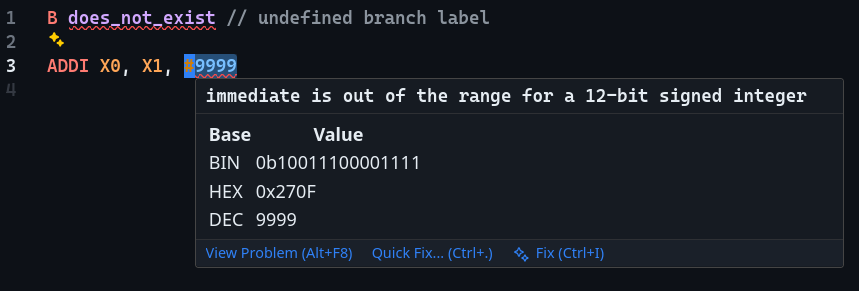
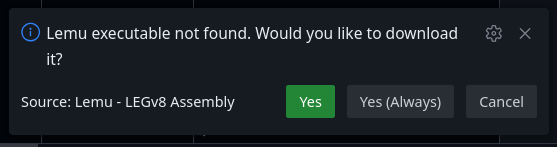
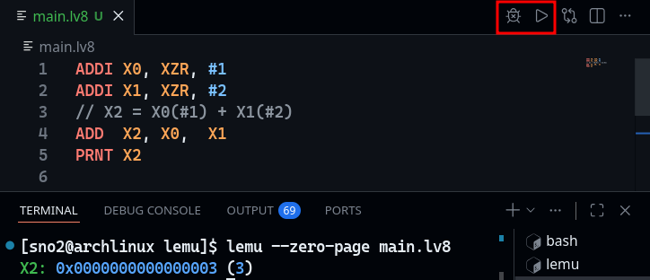
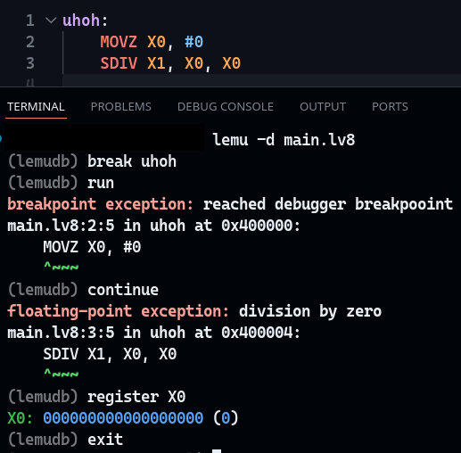
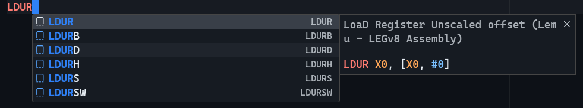

## Lemu - LEGv8 Assembly

A VS Code extension for LEGv8, an academic ISA and assembly language inspired by
ARMv8 described in _Computer Organization And Design Arm Edition_ by Patterson
and Hennessy.

## Features

- Language Server
- Emulator
- Debugger
- Code Snippets
- Syntax Highlighting

The extension prompts you to automatically install a `lemu` executable, or you can [build from source](https://codeberg.org/sno2/lemu#installation)
and set `lemu.exePath`.

### Screenshots

_Language server instruction hints_

_Language server errors_

_Manage installations_

_Emulator_

_Debugger_

_Code Snippets_

## Source code

The VS Code and lemu executable source code are available on [Codeberg](https://codeberg.org/sno2/lemu).
